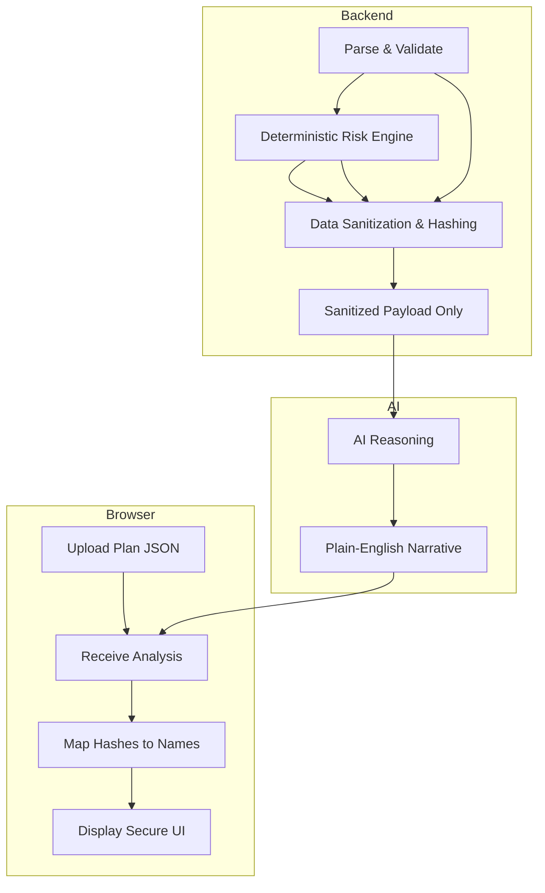

# Detailed Architecture: Secure AI Analysis Pipeline

This document provides a deep dive into how the **Terraform Plan Analyzer** processes your data, detects security risks, and leverages AI—all while ensuring your sensitive infrastructure details never leave your environment.

## The 4-Layer Pipeline

The application follows a "Safe-by-Design" architecture that separates data extraction from AI interpretation.



---

## Layer-by-Layer Deep Dive

### Layer 1: Deterministic Risk Engine
Before the AI is involved, the backend executes a suite of Python-based security rules. These rules are **deterministic**—the same plan always produces the same findings.

- **Logic**: Iterates through resource changes using `risk_engine.py`.
- **Extraction**: Instead of raw values, it identifies **Evidence Tokens**.
    - *Raw*: `cidr_block: "0.0.0.0/0"`
    - *Finding*: `{"public_cidr": true}`

### Layer 2: The Parser & Sanitizer
The `parser.py` performs two critical tasks:
1.  **Diff Skeleton**: It identifies *which* fields changed (keys) but ignores the *values*.
2.  **Resource Hashing**: It replaces identifiable resource addresses with 10-character SHA-256 hashes.
    - `aws_db_instance.prod_db` → `res_9f31a02c1b`

### Layer 3: AI Interpretation (LLM)
The LLM (Claude 3.5 Sonnet) receives only the **Sanitized Payload**. It uses its reasoning capabilities to turn raw security findings into a cohesive narrative and PR comment.

### Layer 4: Frontend Re-Mapping
The frontend maintains a local mapping of `Hash -> Original Name`. When the AI refers to `res_9f31a02c1b`, the UI displays `aws_db_instance (prod_db)`. This ensures readability for you without exposing names to the AI.

---

## 🛡️ Data Privacy Proof

We can prove that sensitive information is never sent to the LLM through three methods:

### 1. Automatic Secret Redaction
The parser's denylist automatically strips values for any keys matching sensitive patterns:
- `password`, `secret`, `token`, `apikey`, `private_key`, `user_data`, and more.

### 2. Command: Inspecting the Internal Payload
You can verify the exact payload sent to the LLM by enabling `DEBUG` logs in the backend. 

**Run this command to see the size and structure of what goes to the AI:**
```bash
# Check the container logs for the 'Sanitized payload' log line
docker logs terraform-webapp-backend-1 | grep "Sanitized payload size"
```

### 3. Comparison View: Raw vs. Sanitized
Here is what the transformation looks like in practice for a database update:

| Feature | Raw Plan (Internal Only) | Sanitized AI Payload (Leaves Env) |
| :--- | :--- | :--- |
| **Resource Name** | `aws_db_instance.production_customer_data` | `res_a9f31b2c1d` |
| **Engine** | `postgres` | `postgres` (safe classification) |
| **Public IP** | `0.0.0.0/0` | `public_access: true` (boolean token) |
| **Password** | `"P@ssw0rd123!"` | **[DELETED]** (Key excluded by denylist) |
| **Tags** | `Owner: "Chris", Project: "Secret-X"` | **[DELETED]** (Metadata excluded) |

---

## How to Verify Locally
To see the hashing in action without calling the real AI, you can run the backend in **Mock Mode** (by unsetting credentials) and look at the `test_response.json`:

```bash
# Analyze a plan
./test_api.sh

# Inspect the hashed resource references in the findings
jq '.risk_findings[].resource_ref' test_response.json
```

Output will look like:
`"res_7b2e1a4d9c"`
`"res_f3a1d9e2b0"`

_This proves that the IDs seen by the AI (and stored in the session) are disconnected from your actual resource names._
